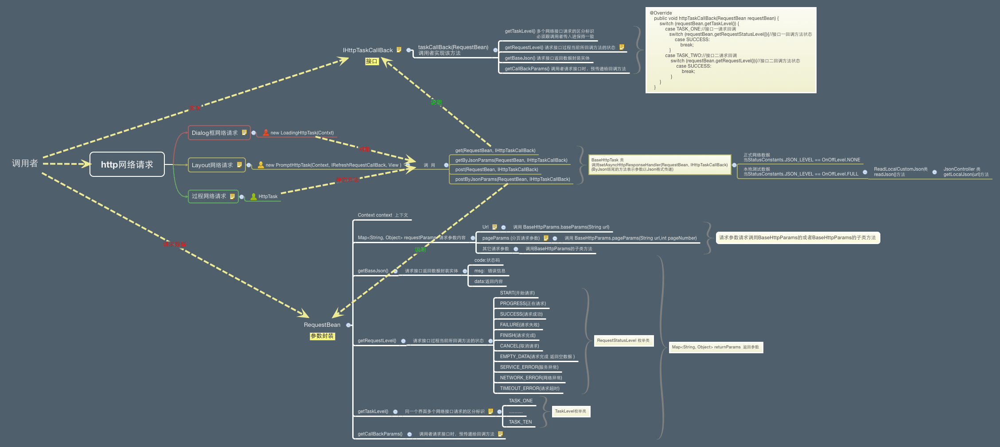
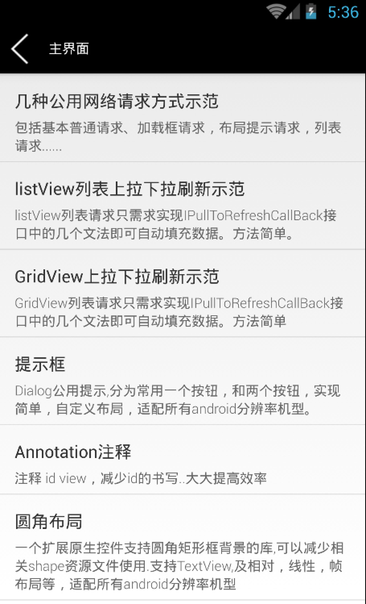

# Framestructure
Android 框架，适合用零开始开发，集成多开源项目等。

##集成开源项目
* Actionbarsherlock 头部状态栏
* Autolayout 分辨率适配
* Imageslider 广告自动轮播
* Litepal 数据库
* PullToRefresh 上拉下拉
* Android-Async-Http 网络请求
* Androidannotations id 注解
* Fastjson Json 自动解析
* Photoview 图片缩放
* Uiversal-Image-Loader 图片缓存
* Base-Adapter 公用Adapter
* PagerSlidingTabStrip  viewger 分布

##特色
* 项目开发中常见三种不同界面显示的网络请求，网络请求封装
* 支持分辨率适配
* 项目图片缓存，自动轮播功能，列表加载，selector图片切换等...简单
* 直接可以开发

##效果图
* 网络请求封装

* 例子

